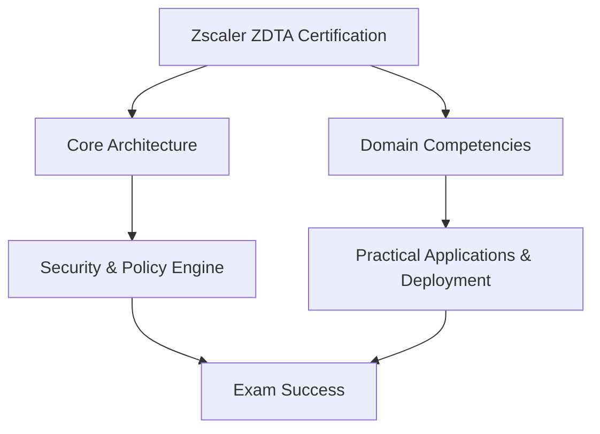

# Zscaler Digital Transformation Associate (ZDTA) (`ZDTA`) - Official Exam Study Guide

Welcome to the comprehensive technical documentation and study repository for the **Zscaler Digital Transformation Associate (ZDTA)** certification exam by **Zscaler**.

## Official Exam Overview & Specifications

This certification evaluates your knowledge, operational capabilities, and technical proficiency in modern enterprise environments.

- **Exam Title**: Zscaler Digital Transformation Associate (ZDTA)
- **Exam Code**: `ZDTA`
- **Vendor**: Zscaler
- **Exam Duration**: 90 Minutes
- **Number of Questions**: 60
- **Passing Score**: 70%

### Domain Weighting Breakdown Table

| Domain / Objective | Weight |
| :--- | :--- |
| Cloud Security Fundamentals & Zero Trust Architecture | 30% |
| Zscaler Internet Access (ZIA) Core Services | 25% |
| Zscaler Private Access (ZPA) Deployment & Access Controls | 25% |
| Traffic Redirection & User Authentication | 20% |

## Architectural Workflow & Learning Map

## Technical Demo Practice Questions

The following 10 practice questions simulate actual exam topics and scenarios.

### Question 1
**In a Zero Trust architecture using Zscaler solutions, which core principle replaces traditional perimeter-based security controls?**

- A. Implicit trust based on internal corporate IP addresses
- B. Least-privilege explicit access based on user identity and context
- C. Network-level routing using GRE tunnels without authentication
- D. Standard perimeter firewalling with stateful packet inspection

**Correct Answer**: `B. Least-privilege explicit access based on user identity and context`

**Explanation**: Zero Trust eliminates implicit network trust. Zscaler enforces explicit access based on authenticated user identity, device posture, and context rather than network placement.

---

### Question 2
**Which mechanism does Zscaler Private Access (ZPA) use to connect users directly to private applications without exposing the internal network?**

- A. Inbound listener ports on enterprise firewalls
- B. Inside-out TLS tunnels initiated by App Connectors and Zscaler Client Connector
- C. Public IP address mapping and NAT traversal
- D. Direct site-to-site IPSec VPN tunnels

**Correct Answer**: `B. Inside-out TLS tunnels initiated by App Connectors and Zscaler Client Connector`

**Explanation**: ZPA establishes inside-out micro-segmented connections, ensuring no inbound firewall ports are opened to the public internet.

---

### Question 3
**How does Zscaler Internet Access (ZIA) perform full SSL/TLS inspection without causing severe latency bottlenecks?**

- A. By storing decryption keys on client local disk
- B. By using custom hardware-accelerated Single-Scan Multi-Tenant Architecture (SSMA) in global Edge nodes
- C. By skipping certificate validation on trusted domain names
- D. By relying on client-side proxy autoconfiguration (PAC) scripts to bypass encrypted traffic

**Correct Answer**: `B. By using custom hardware-accelerated Single-Scan Multi-Tenant Architecture (SSMA) in global Edge nodes`

**Explanation**: Zscaler SSMA inspects payload in memory in a single pass at cloud scale, preventing performance degradation during SSL/TLS deep packet inspection.

---

### Question 4
**When configuring policies related to Traffic Redirection & User Authentication in ZDTA, which component evaluates posture and user group membership prior to session establishment?**

- A. Identity Provider (IdP) integration combined with Zscaler Policy Engine
- B. Local Active Directory Domain Controller without SAML 2.0
- C. Legacy RADIUS server operating on port 1812
- D. Perimeter Router Access Control List (ACL)

**Correct Answer**: `A. Identity Provider (IdP) integration combined with Zscaler Policy Engine`

**Explanation**: Zscaler integrates with SAML 2.0 / SCIM IdPs to validate user identity and device posture before making policy enforcement decisions for Traffic Redirection & User Authentication.

---

### Question 5
**When configuring policies related to Cloud Security Fundamentals & Zero Trust Architecture in ZDTA, which component evaluates posture and user group membership prior to session establishment?**

- A. Identity Provider (IdP) integration combined with Zscaler Policy Engine
- B. Local Active Directory Domain Controller without SAML 2.0
- C. Legacy RADIUS server operating on port 1812
- D. Perimeter Router Access Control List (ACL)

**Correct Answer**: `A. Identity Provider (IdP) integration combined with Zscaler Policy Engine`

**Explanation**: Zscaler integrates with SAML 2.0 / SCIM IdPs to validate user identity and device posture before making policy enforcement decisions for Cloud Security Fundamentals & Zero Trust Architecture.

---

### Question 6
**When configuring policies related to Zscaler Internet Access (ZIA) Core Services in ZDTA, which component evaluates posture and user group membership prior to session establishment?**

- A. Identity Provider (IdP) integration combined with Zscaler Policy Engine
- B. Local Active Directory Domain Controller without SAML 2.0
- C. Legacy RADIUS server operating on port 1812
- D. Perimeter Router Access Control List (ACL)

**Correct Answer**: `A. Identity Provider (IdP) integration combined with Zscaler Policy Engine`

**Explanation**: Zscaler integrates with SAML 2.0 / SCIM IdPs to validate user identity and device posture before making policy enforcement decisions for Zscaler Internet Access (ZIA) Core Services.

---

### Question 7
**When configuring policies related to Zscaler Private Access (ZPA) Deployment & Access Controls in ZDTA, which component evaluates posture and user group membership prior to session establishment?**

- A. Identity Provider (IdP) integration combined with Zscaler Policy Engine
- B. Local Active Directory Domain Controller without SAML 2.0
- C. Legacy RADIUS server operating on port 1812
- D. Perimeter Router Access Control List (ACL)

**Correct Answer**: `A. Identity Provider (IdP) integration combined with Zscaler Policy Engine`

**Explanation**: Zscaler integrates with SAML 2.0 / SCIM IdPs to validate user identity and device posture before making policy enforcement decisions for Zscaler Private Access (ZPA) Deployment & Access Controls.

---

### Question 8
**When configuring policies related to Traffic Redirection & User Authentication in ZDTA, which component evaluates posture and user group membership prior to session establishment?**

- A. Identity Provider (IdP) integration combined with Zscaler Policy Engine
- B. Local Active Directory Domain Controller without SAML 2.0
- C. Legacy RADIUS server operating on port 1812
- D. Perimeter Router Access Control List (ACL)

**Correct Answer**: `A. Identity Provider (IdP) integration combined with Zscaler Policy Engine`

**Explanation**: Zscaler integrates with SAML 2.0 / SCIM IdPs to validate user identity and device posture before making policy enforcement decisions for Traffic Redirection & User Authentication.

---

### Question 9
**When configuring policies related to Cloud Security Fundamentals & Zero Trust Architecture in ZDTA, which component evaluates posture and user group membership prior to session establishment?**

- A. Identity Provider (IdP) integration combined with Zscaler Policy Engine
- B. Local Active Directory Domain Controller without SAML 2.0
- C. Legacy RADIUS server operating on port 1812
- D. Perimeter Router Access Control List (ACL)

**Correct Answer**: `A. Identity Provider (IdP) integration combined with Zscaler Policy Engine`

**Explanation**: Zscaler integrates with SAML 2.0 / SCIM IdPs to validate user identity and device posture before making policy enforcement decisions for Cloud Security Fundamentals & Zero Trust Architecture.

---

### Question 10
**When configuring policies related to Zscaler Internet Access (ZIA) Core Services in ZDTA, which component evaluates posture and user group membership prior to session establishment?**

- A. Identity Provider (IdP) integration combined with Zscaler Policy Engine
- B. Local Active Directory Domain Controller without SAML 2.0
- C. Legacy RADIUS server operating on port 1812
- D. Perimeter Router Access Control List (ACL)

**Correct Answer**: `A. Identity Provider (IdP) integration combined with Zscaler Policy Engine`

**Explanation**: Zscaler integrates with SAML 2.0 / SCIM IdPs to validate user identity and device posture before making policy enforcement decisions for Zscaler Internet Access (ZIA) Core Services.

---

## Preparation Strategy & Resources

To ensure complete mastery of the exam objectives, combine theoretical study with hands-on practice. Access premium [ZDTA demo practice questions](https://www.certsclub.com) to evaluate your readiness with realistic simulated practice tests and domain assessments.
